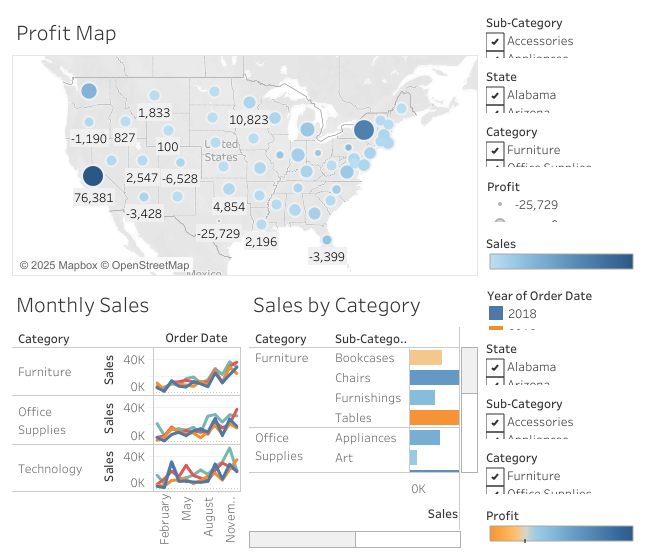

# 📈 Tableau Sales Dashboard

This project uses Tableau to visualize overall sales performance, customer segments, and brand profitability across regions.

## 🔍 Key Insights

- 💼 Technology had the highest total sales among all categories.
- 🪑 Furniture category had strong quantity sales but lower profitability.
- 🌍 California, New York, and Texas contributed the most in profits.
- 👥 Consumer segment is the dominant customer group across most states.
- 🏆 Canon is the most profitable brand based on overall performance.

## 📷 Dashboard Screenshots

### 🔸 Main Sales Overview

### 🔸 Profit and Loss by State

### 🔸 Top Brands and Customer Segment Distribution

## 📂 Files Included

- `SalesPerformance.twbx` – Tableau Packaged Workbook file
- `Dashboard 1.png` – Main sales dashboard view
- `Screenshot_9-5-2025_194721_public.tableau.com.jpeg` – Regional performance
- `Screenshot_9-5-2025_19509_public.tableau.com.jpeg` – Segment and brand view

## 🛠 Tools Used

- Tableau Public
- Excel (as data source)
- GitHub for project documentation

