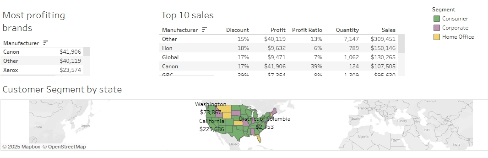
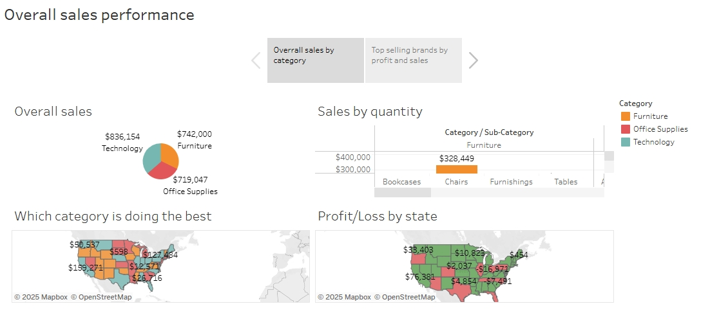

Tableau Sales Dashboard

This project uses Tableau to visualize overall sales performance, customer segments, and brand profitability across regions.

 Dashboard Screenshots

 Main Sales Overview
Dashboard 1.png

 Profit and Loss by State

 Top Brands and Customer Segment Distribution

 Files Included

- `SalesPerformance.twbx` – Tableau Packaged Workbook file
- `Dashboard 1.png` – Main sales dashboard view
- `Screenshot_9-5-2025_194721_public.tableau.com.jpeg` – Regional performance
- `Screenshot_9-5-2025_19509_public.tableau.com.jpeg` – Segment and brand view

